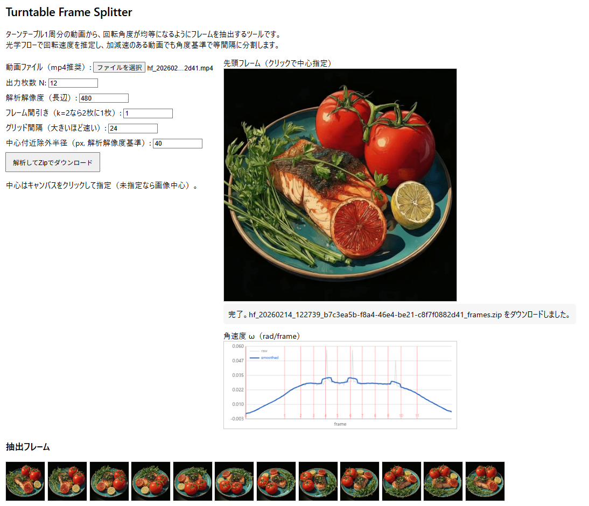

# Turntable Frame Splitter

ターンテーブル1周分の動画から、**回転角度が均等になるように**フレームを抽出するツールです。

フレーム番号で等間隔に切り出すのではなく、動画内の実際の回転量を推定して「角度で均等」に分割します。加速・減速のあるS字カーブの回転にも対応します。

## 使い方

1. `run.bat` をダブルクリック（ブラウザが自動で開きます）
2. 動画ファイル（mp4推奨）を選択
3. 必要に応じてパラメータを調整
4. 「解析してZipでダウンロード」をクリック
5. 解析完了後、角速度グラフと抽出フレームのプレビューが表示され、ZIPが自動ダウンロードされます

## パラメータ

| 項目 | デフォルト | 説明 |
|------|-----------|------|
| 出力枚数 N | 12 | 1周を何枚に分割するか |
| 解析解像度（長辺） | 480 | 内部処理の解像度。大きいほど精度は上がるが遅くなる |
| フレーム間引き | 1 | 2なら2フレームに1枚だけ使う。長い動画で高速化 |
| グリッド間隔 | 24 | 光学フロー計算のグリッド幅。大きいほど速い |
| 中心付近除外半径 | 40 | 回転中心付近のノイズを除外する範囲(px) |

## うまくいかないとき

- **特徴の少ない被写体**（白い皿など）でフローが弱い場合
  - 解析解像度を 640 に上げる
  - グリッド間隔を 16〜24 に下げる
- **OpenCV.js の読み込みに失敗する場合**
  - [opencv.js](https://docs.opencv.org/4.x/opencv.js) と opencv.wasm をダウンロードしてプロジェクトフォルダに配置
  - `worker.js` の `importScripts(...)` を `importScripts("./opencv.js")` に変更

## 動作環境

- PC ブラウザ（Chrome / Edge 推奨）
- Python 3（ローカルサーバー用）

## 仕組み

処理はすべてブラウザ内で完結します（サーバーへのアップロードなし）。

1. **フレーム取得** -- 動画を再生しながらフレームを取得し、解析用に縮小
2. **角速度推定** -- OpenCV.js の Farneback 光学フローで各フレーム間のピクセル移動を計算し、グリッド点ごとに角速度 `ω ≈ (flow・t) / r` を求め、中央値で集約
3. **角度算出** -- 角速度を積分して累積角度 θ を求め、最終フレームが 2π（1周）になるよう正規化
4. **均等サンプリング** -- 目標角度 `0, 2π/N, 2×2π/N, ...` に最も近いフレームを選択し、PNG で出力
